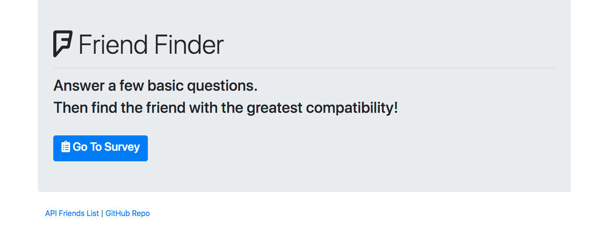
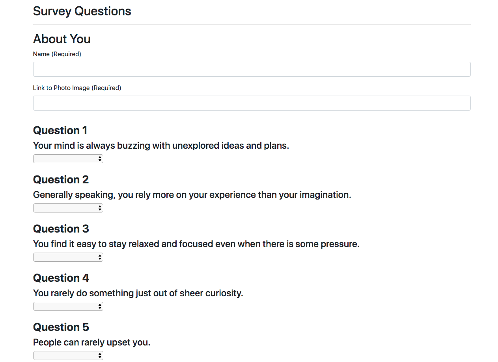
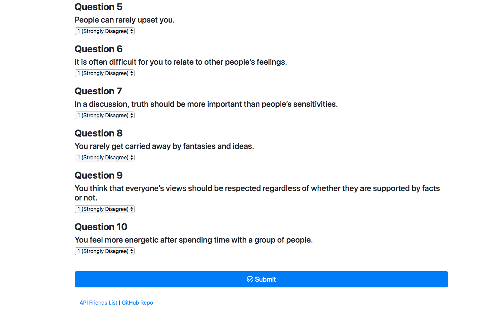
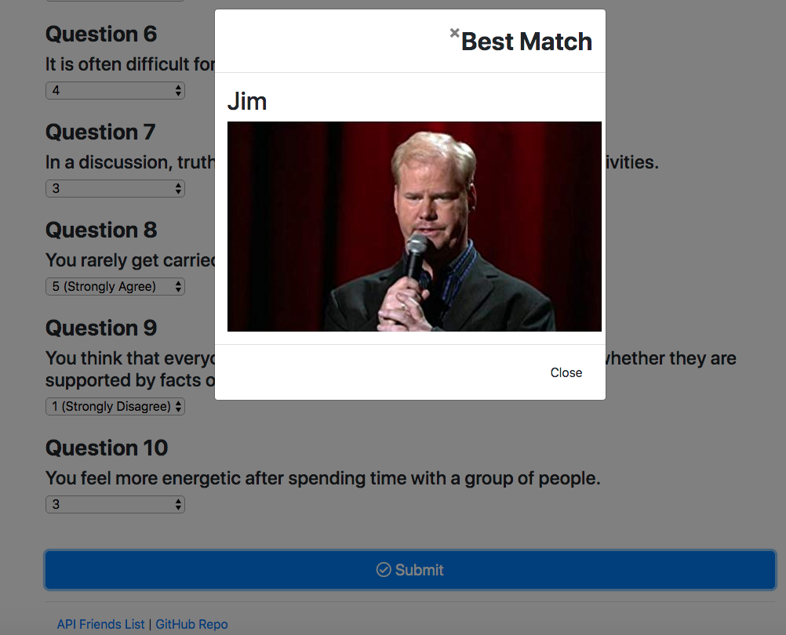

# friend-finder
## Overview

In this activity, you'll build a compatibility-based "FriendFinder" application -- basically a dating app. This full-stack site will take in results from your users' surveys, then compare their answers with those from other users. The app will then display the name and picture of the user with the best overall match.

You will use Express to handle routing. Make sure you deploy your app to Heroku so other users can fill it out.

# Home Page 

# Survey Page 

# Filled Form Ready To Submit 

# User Results 

